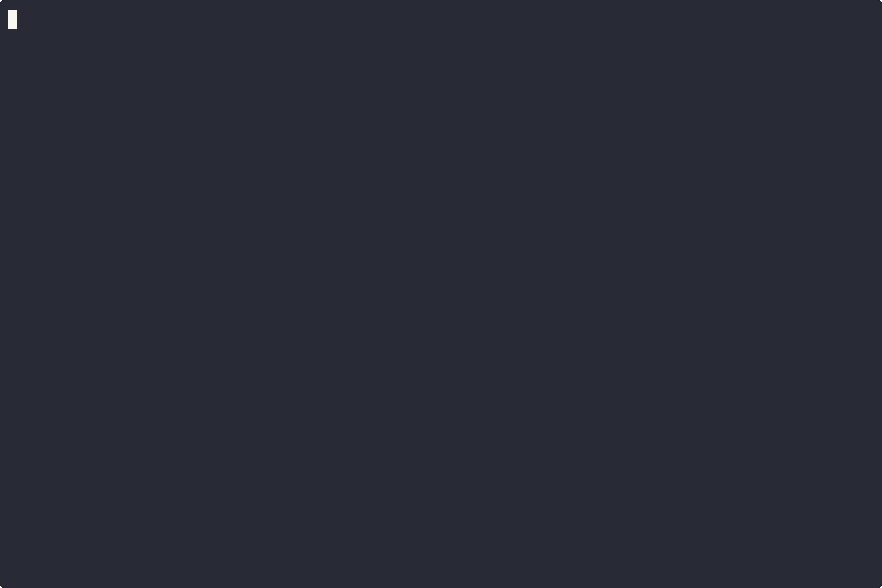

# Scaffold

Scaffold is a CLI tool that helps developers easily create or update files according to best practices.



## Installation

### Via Homebrew
```bash
brew install kjuulh/tap/scaffold
```

### Via Go
```bash
go install github.com/kjuulh/scaffold@latest
```

## Usage

Basic usage:
```bash
# Set this in your .zshrc or .bashrc file
export SCAFFOLD_REGISTRY=https://github.com/kjuulh/scaffold.git # Optional: use your own templates

scaffold
# Follow the interactive prompts:
# 1. Pick a template
# 2. Fill required information
# 3. Profit
```

Direct template selection:

```bash
scaffold externalhttp # Optional flags: --package app
```

Scaffold offers various formatting options, including template-defined inputs, customizable file placement, and overwrite controls.

## Creating Your Own Templates

Templates are maintained in the `registry` folder, which is automatically kept up-to-date by `scaffold`.

To create your own templates:

1. Fork the [example registry](https://github.com/kjuulh/scaffold-example-registry)
2. Create a new template:
   ```bash
   ./scaffold.sh scaffold --name <your-template-name>
   ```

### Template Structure

A template consists of:

- `scaffold.yaml`: Controls template behavior and inputs
- `scaffold_test.go`: Optional but recommended tests
- `files/*.gotmpl`: Template files (using `.gotmpl` extension, especially for Go files)
- `testdata/your_test_here/actual` and `expected`: Test output validation

Templates use Go's templating system, and the folder structure is preserved when scaffolding.

### Testing Templates


The testing system is snapshot-based:
- Test various inputs against your templates
- Compare actual output with expected output
- To accept test changes: delete the "expected" folder if it exists, and rename "actual" to "expected"

To make your template available to others, create a PR to the main repository.
